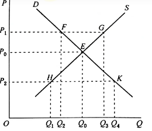

# 经济学

*杂七杂八的经济学知识*

## 0 基础

经济学研究 **经济资源的配置与利用**

经济学的假设：
- 稀缺：资源的有限性和需求的无限性之间的矛盾
- 经济人假设：所有人都力图最小经济代价换取最大经济利益

历史：
- 1776 年亚当斯密《国富论》标志着 **微观经济学** 的诞生
- 1936 年凯恩斯《就业、利息和货币通论》标志着 **宏观经济学** 的诞生

## 1 微观经济学

主要内容：
- 供给需求分析，弹性
- 消费者怎样决定消费？
- 生产者怎样决定生产？
- 要素所有者如何决定要素供给（劳动、土地、资本等）？
- 市场势力对市场供需平衡的影响（完全竞争、垄断、寡头、垄断竞争）
- 市场为什么还需要国家干预？

研究方法：
- 静态分析
- 比较静态分析
- 动态分析

> 可以类比热力学中分别研究平衡态、准静态过程和非准静态过程，平衡态就是经济学上的均衡

### 1.1 供给和需求

需求量：消费者 **意愿** 而且 **能够购买** 的商品数量，主要决定因素有：
- 商品的价格 
- 消费者收入水平
- 相关商品的价格
- 消费者偏好
- 消费者的价格预期

供给量：生产者 **意愿** 而且 **能够提供** 的商品数量，主要决定因素有：
- 商品的价格
- 生产的成本
- 生产的技术水平
- 相关商品的价格
- 生产者对未来的预期

供给需求分析：
- 规律：
    - 需求规律：其他因素不变，需求量与价格之间反向依存
    - 供给规律：其他因素不变，供给量与价格之间正向依存
- 量化：需求函数、供给函数，需求图像、供给图像，需求量 / 供给量 $Q$（Quantity），价格 $P$（Price）
- 均衡：供给量和需求量相等
    - 市场供求力量的自发调节形成均衡
    - 需求增加 / 减少，均衡价格上升 / 下降，均衡数量增加 / 减少
    - 供给增加 / 减少，均衡价格下降 / 上升，均衡数量增加 / 减少
- 例外：珠宝、证券等

弹性（Elasticity）：A 对 B 的变化量的反应程度，定义为

$$ e = \frac{\Delta A /A}{\Delta B / B} $$

- 需求价格弹性：需求量对价格变动的反应程度
    - $ |e_{d}| <1 $：缺乏弹性（生活必需品）
    - $ |e_{d}| > 1 $：富有弹性（奢侈品）
- 供给价格弹性：供给量对价格变动的反应程度
- 需求收入弹性：需求量对消费者收入变动的反应程度
    - $ e_{M} > 0 $：正常品
    - $ e_{M} < 0 $：劣等品
- 需求交叉价格弹性：X 的需求量对 Y 价格变动的反应程度
    - $ e_{XY} > 0 $：替代关系（地铁越贵，乘公交的人越多）
    - $ e_{XY} < 0 $：互补关系（电脑越贵，买电脑软件的人越少）

### 1.2 消费者的决定

需求曲线是怎么推导出来的？

引入 **效用**：商品满足消费者欲望的程度

以下两种观点都能推导出（多种商品的）需求量与价格的关系：
- 基数效用论：效用可计量（实数域）
- 序数效用论：效用之间只能排序（全序集）

基数效用论：
- 效用是消费数量的函数 $ TU_{i} = f(X_{i}) $
- 边际效用：增加一单位商品的消费带来的效用 $ MU_{i}=\Delta TU_{i} / \Delta X_{i} $（效用函数的斜率）
- 边际效用递减规律：$ MU_{i}(X_{i}) $ 递减（效用函数上凸）
- 消费者均衡条件：最后一元钱购买该商品所带来的边际效用和付出一元钱的货币的边际效用相等：$MU_{i}/P_{i} = \lambda $

序数效用论：
- 无差异曲线：表示消费者偏好相同的商品组合的曲线 $ f(X_{1},\cdots,X_{n})=0 $
- 边际替代率：维持效用水平，增加消费一单位商品 1 时放弃商品 2 的消费数量 $ MRS_{ij} = -\Delta X_{j}/\Delta X_{i} $（无差异曲线的负斜率）
- 边际替代率递减规律：$ MRS_{ij}(X_{i}) $ 递减（无差异曲线下凸）
- 消费者均衡条件：预算线 $ \sum P_{i} X_{i} = I $ 和无差异曲线相切点

## 2 凯恩斯宏观经济学派

凯恩斯宏观经济学派力图分析并解决有效需求不足问题。

有效需求不足：闲置 -> 减产 -> 失业 -> 消费减少 -> 闲置
- 边际消费倾向递减：人们不愿消费
- 资本编辑效率递减：资本家不愿投资
- 流动性偏好：宁愿持有流动性高但不能生利的货币，也不愿持有其他虽能生利但较难变现的资产

$$ GDP = Y = C + I + G + (X - M)$$

含义：
- 国内生产总值 GDP
- 国民收入 Y
- 消费 C
- 投资 I
- 政府购买 G
- (出口 X - 进口 M)

### 2.1 消费

$$ C = a + by $$

含义：
- 消费 C
- 自发性消费 a
- 边际消费倾向 b
- 收入 y

> 收入越高，消费越高

### 2.2 投资

$$ I = e - dr $$

含义：
- 投资 I
- 自主投资 e
- 投资需求对利率变动的敏感系数 d
- 利率 r

> 利率越低，投资越高

根据投资和消费公式，忽略进出口，得到：

$$y = \frac{a + e-dr + G}{1-b}$$

*—— IS 曲线*

### 2.3 货币

货币需求 L *——持有现金的需求*
- 交易动机：和收入正相关
- 预防动机：和收入正相关
- 投机动机：和利率负相关

$$ L = ky - hr$$

货币供给 M：短期内为定值 *——央行发布的货币量*

长期内，货币供给和货币需求达成均衡：

$$ky - hr = M$$

*—— LM 曲线*

### 2.4 IS-LM 模型

两条利率-收入曲线：
- IS 曲线：产品市场

$$y = \frac{a + e-dr + G}{1-b}$$

- LM 曲线：货币市场

$$ky - hr = M$$

政策：
- 增加政府购买，IS 曲线向右移动 *——扩张的财政政策*
- 减少政府购买，IS 曲线向左移动 *——紧缩的财政政策*
- 提高货币供给量，LM 曲线向右移动 *——扩张的货币政策*
- 减少货币供给量，LM 曲线向左移动 *——紧缩的货币政策*

### 2.5 AD-AS 模型

物价 P：
- 持续上涨：通货膨胀
- 持续下降：通货紧缩

两条物价-收入曲线：
- AD 曲线：总需求，由 IS-LM 模型推导，引入变量物价 P
- AS 曲线：总供给

菲利普斯曲线：由 AD-AS 模型推导而来

## 3 经济周期

### 3.1 经济运行的动力

经济运行三股动力：
- 生产率的提高，取决于劳动力、制度创新或者技术创造，由生产力决定
- 短期债务周期，取决于借贷意愿，由利率决定
- 长期债务周期，取决于债务负担，由杠杆率决定

### 3.2 基本概念

交易：
- 买方，作为需求方，提供货币或者信用
- 卖方，作为供给方，提供商品、服务或金融资产
- 买卖双方的交易通过价格这一因素撮合
- 价格 = 支出额 / 产销量

经济：
- 交易构成市场
- 无数市场组成经济
- 支出总额 & 产销总量

政府是最大的买方和卖方，有两个部分：
- 中央政府：花钱、收税
- 中央银行：调整利率、发行货币

### 3.3 信贷

信贷：
- 贷款人的资产
- 借款人的负债

循环：借贷 -> 支出 -> 收入 -> 借贷

- 无信贷：经济增长只取决于生产率
- 有信贷：产生周期

信贷本质上是跟未来的自己借钱满足当下的需求。

### 3.4 周期

短期债务与长期债务：
- 短期债务和借贷意愿有关，类比胃口，胃口好就多吃一点。央行控制利率，控制借贷成本，进而控制借贷意愿，从而控制短期债务周期。
- 长期债务则和胃容量有关，如果吃的东西超过胃的最大容量，肚子就有被撑爆的风险，其中关键的变量是债务负担（债务/收入）

短期债务周期：
1. 信用扩张，支出增加
2. 支出增加，价格上涨，通货膨胀
3. 经济过热，央行提高利率
4. 债务减少，还款额增加
5. 支出收入减少，价格下跌，通货紧缩
6. 经济衰退，央行降低利率
7. 偿贷下降，另一次经济扩张

长期债务周期：
1. 一开始，债务的增速可以用收入的增速来缓解，吃进去的东西还能被及时消化代谢
2. 渐渐地，收入的增速比不上债务的增速，进入借贷 -> 支出 -> 收入 -> 借贷的负反馈循环，债务负担加剧到一定程度，产生债务危机
3. 出现债务危机时
    - 借款人的债务负担过重，无法通过降低利率来减轻
    - 贷款人意识到，债务过于庞大，无法足额得到偿还
    - 借款人失去偿贷能力，且抵押物失去价值，不想再借入更多债务
    - 贷款人停止放贷，借款人停止借贷
4. 最后，从债务危机中恢复，进入新的周期

### 3.5 去杠杆

为了减轻债务负担：
- 收入增长的速度超过债务增长的速度
- 改善借贷人的信用
- 打破借贷 -> 支出 -> 收入 -> 借贷的负反馈循环

去杠杆化方法：
- 削减支出：通货紧缩
- 减少债务：债务违约 / 债务重组，通货紧缩
- 财富再分配：财务资助，刺激计划
- 发行货币：央行印钱配合政府举债

