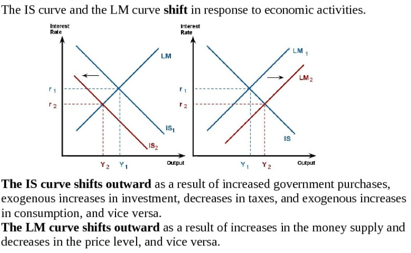
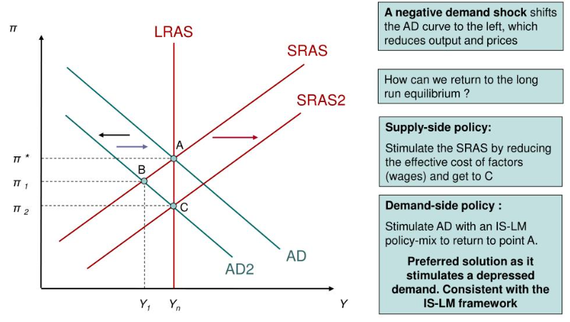

# 经济学

*本文零散地记录了杂七杂八的经济学知识*

## 1 历史

1776 年亚当斯密《国富论》标志着微观经济学的诞生

1936 年凯恩斯《就业、利息和货币通论》标志着宏观经济学的诞生

## 2 凯恩斯宏观经济学派

有效需求不足：闲置 -> 减产 -> 失业 -> 消费减少 -> 闲置
- 边际消费倾向递减：人们不愿消费
- 资本编辑效率递减：资本家不愿投资
- 流动性偏好：宁愿持有流动性高但不能生利的货币，也不愿持有其他虽能生利但较难变现的资产

$$ GDP = Y = C + I + G + (X - M)$$

含义：
- 国内生产总值 GDP
- 国民收入 Y
- 消费 C
- 投资 I
- 政府购买 G
- (出口 X - 进口 M)

### 2.1 消费

$$ C=a + by $$

含义：
- 消费 C
- 自发性消费 a
- 边际消费倾向 b
- 收入 y

> 收入越高，消费越高

### 2.2 投资

$$ I = e -dr$$

含义：
- 投资 I
- 自主投资 e
- 投资需求对利率变动的敏感系数 d
- 利率 r

> 利率越低，投资越高

$$y = \frac{a + e-dr + G}{1-b}$$

*—— IS 曲线*

### 2.3 货币

货币需求 L *——持有现金的需求*
- 交易动机：和收入正相关
- 预防动机：和收入正相关
- 投机动机：和利率负相关

$$ L = ky - hr$$

货币供给 M：短期内为定值 *——央行发布的货币量*

长期内，货币供给和货币需求达成均衡：

$$ky - hr = M$$

*—— LM 曲线*

### 2.4 IS-LM 模型

两条利率-收入曲线：
- IS 曲线：产品市场

$$y = \frac{a + e-dr + G}{1-b}$$

- LM 曲线：货币市场

$$ky - hr = M$$

政策：
- 增加政府购买，IS 曲线向右移动 *——扩张的财政政策*
- 减少政府购买，IS 曲线向左移动 *——紧缩的财政政策*
- 提高货币供给量，LM 曲线向右移动 *——扩张的货币政策*
- 减少货币供给量，LM 曲线向左移动 *——紧缩的货币政策*

### 2.5 AD-AS 模型

物价 P：
- 持续上涨：通货膨胀
- 持续下降：通货紧缩

两条物价-收入曲线：
- AD 曲线：总需求，由 IS-LM 模型推导，引入变量物价 P
- AS 曲线：总供给

菲利普斯曲线：由 AD-AS 模型推导而来

## 3 经济周期

### 3.1 经济运行的动力

经济运行三股动力：
- 生产率的提高，取决于劳动力、制度创新或者技术创造，由生产力决定
- 短期债务周期，取决于借贷意愿，由利率决定
- 长期债务周期，取决于债务负担，由杠杆率决定

### 3.2 基本概念

交易：
- 买方，作为需求方，提供货币或者信用
- 卖方，作为供给方，提供商品、服务或金融资产
- 买卖双方的交易通过价格这一因素撮合
- 价格 = 支出额 / 产销量

经济：
- 交易构成市场
- 无数市场组成经济
- 支出总额 & 产销总量

政府是最大的买方和卖方，有两个部分：
- 中央政府：花钱、收税
- 中央银行：调整利率、发行货币

### 3.3 信贷

信贷：
- 贷款人的资产
- 借款人的负债

循环：借贷 -> 支出 -> 收入 -> 借贷

- 无信贷：经济增长只取决于生产率
- 有信贷：产生周期

信贷本质上是跟未来的自己借钱满足当下的需求。

### 3.4 周期

短期债务与长期债务：
- 短期债务和借贷意愿有关，类比胃口，胃口好就多吃一点。央行控制利率，控制借贷成本，进而控制借贷意愿，从而控制短期债务周期。
- 长期债务则和胃容量有关，如果吃的东西超过胃的最大容量，肚子就有被撑爆的风险，其中关键的变量是债务负担（债务/收入）

短期债务周期：
1. 信用扩张，支出增加
2. 支出增加，价格上涨，通货膨胀
3. 经济过热，央行提高利率
4. 债务减少，还款额增加
5. 支出收入减少，价格下跌，通货紧缩
6. 经济衰退，央行降低利率
7. 偿贷下降，另一次经济扩张

长期债务周期：
1. 一开始，债务的增速可以用收入的增速来缓解，吃进去的东西还能被及时消化代谢
2. 渐渐地，收入的增速比不上债务的增速，进入借贷 -> 支出 -> 收入 -> 借贷的负反馈循环，债务负担加剧到一定程度，产生债务危机
3. 出现债务危机时
    - 借款人的债务负担过重，无法通过降低利率来减轻
    - 贷款人意识到，债务过于庞大，无法足额得到偿还
    - 借款人失去偿贷能力，且抵押物失去价值，不想再借入更多债务
    - 贷款人停止放贷，借款人停止借贷
4. 最后，从债务危机中恢复，进入新的周期

### 3.5 去杠杆

为了减轻债务负担：
- 收入增长的速度超过债务增长的速度
- 改善借贷人的信用
- 打破借贷 -> 支出 -> 收入 -> 借贷的负反馈循环

去杠杆化方法：
- 削减支出：通货紧缩
- 减少债务：债务违约 / 债务重组，通货紧缩
- 财富再分配：财务资助，刺激计划
- 发行货币：央行印钱配合政府举债