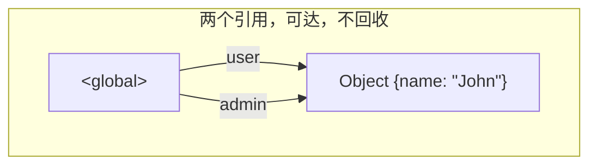
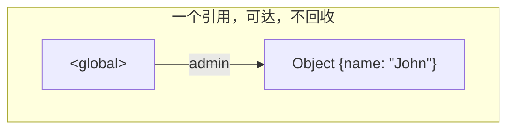
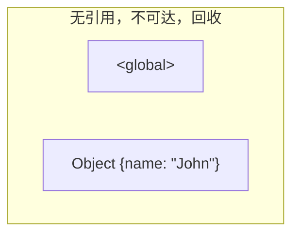
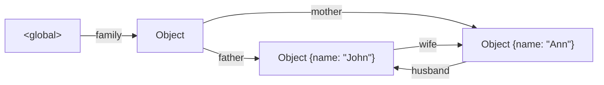

# 面向对象

## 1 创建对象

```js
let obj1 = new Object(); // 构造函数语法
let obj2 = {};           // 字面量语法
```

JavaScript 里的对象存储一系列属性（键值对），其中：
- 属性的键必须是字符串或者 symbol（通常是字符串），其他类型自动转换为字符串。
- 属性的值可以是任何类型。

```js
let number = 10;
let key = "gender";

let user = {             // user 对象
    name: "John",        // 键 "name"，值 "John"
    age: 30,             // 键 "age"，值 30
    number,              // 属性值简写，相当于 number: number
    "like birds": true,  // 多字词语作为键，必须加上引号
    [key]: "default",    // 计算属性，相当于 "gender": "default"
}
```

> JavaScript 的对象表示语法衍生出一种独立的文本数据交换格式 JSON（JavaScript Object Notation），它独立于语言和平台。

## 2 对象操作

- 访问属性：
    - 点符号：`obj.property`。可被赋值。
    - 方括号：`obj["property"]` 或 `obj[keyOfProperty]`。可被赋值。
- 删除属性：`delete obj.property`，`delete obj["property"]`。
- 检查是否存在给定键的属性：`"property" in obj`。
- 遍历对象：`for(let prop in obj)` 循环。

```js
alert(user.name);           // John，访问 user 的 "name" 属性
alert(user["age"]);         // 30，访问 user 的 "age" 属性
alert(user["like birds"]);  // true，访问 user 的 "like birds" 属性
user.age = 40;              // 访问并修改 user 的 "age" 属性的值

user.isAdmin = false;       // 增加属性，键 "isAdmin"，值 false

delete user.name;           // 删除 user 的 "name" 属性
delete user["like bird"];   // 删除 user 的 "like birds" 属性
```

```js
alert(user.noSuchProperty);   // undefined，不存在的属性的值为 undefined
alert("age" in user);         // true，"age" 是 user 的属性
alert("like birds" in user);  // false，"like birds" 不是 user 的属性

let obj = {
    test: undefined
};
alert(obj.test === undefined);  // true，test 属性不存在吗？
alert("test" in obj);           // true，test 属性存在！
```

```js
for(let key in user)
{
    alert(key);
    alert(user[key]);
}
```

对象属性中，整数属性会被自动排序，其他属性则按照创建的顺序排序。

以上介绍的对象其实叫做“普通对象（plain object）”，简称为对象。

## 3 拷贝对象

对象通过引用被赋值和拷贝。与原始类型变量不同，对象变量存储的不是对象的“值”，而是对象的“引用”（内存地址）。因此，拷贝此类变量或将其作为函数参数传递时，所拷贝的是引用，而非对象本身。

因此，对于对象变量，所有对副本的操作（如添加、删除属性）都会同步更新到原本上。

为了创建“真正的拷贝”，我们可以使用 `Object.assign(dest, [src1, src2,...])` 来做“浅拷贝”，或者使用 lodash 库的 `_.cloneDeep(obj)`来做“深拷贝”。

```js
/* 拷贝 */
let user = {name: "John";}
let admin = user;        // admin 和 user 保存的是对同一个对象的引用
admin.name = "Pete";     // 通过 admin 引用来修改属性的值
alert(user.name);        // Pete，修改能通过 user 引用看到

/* 比较 */
alert(admin == user);    // true，都引用同一个对象
alert(admin === user);   // true，类型也相同
alert(({}) == ({}));     // false，引用不同的对象

/* Object.assign 的用法 */
/* 用于浅拷贝 */
let clone = Object.assign({}, user); // Object.assign 返回目标对象，实现浅拷贝
/* 用于添加和覆盖属性 */
let permissions1 = {canView: true};
let permissions2 = {canEdit: false};
Object.assign(user,                  // 目标对象
              permission1,           // 源对象 permission1
              permission2,           // 源对象 permission2
              {name: "Sam"});        // 源对象 {name: "Sam"}
alert(user.name);        // Sam，目标对象的 "name" 属性值被源对象的属性值覆盖
alert(user.canView);     // true，源对象的属性拷贝到目标对象 user 中
```

## 4 垃圾回收

> 早期的计算机语言，如 C, 需要显式地向操作系统请求内存和释放内存。这种做法的优点是效率高，但对于存在着大量的内存分配和释放操作的复杂系统，程序员容易忘记释放内存，从而造成内存泄露。因此，现代编程语言，如 Java、C#，都提供了“垃圾回收机制”：程序员只需要请求内存，而无需关注内存的释放，因为垃圾回收器会适时释放已经终止生命周期的变量的内存。

```js
let user = {
  name: "John"
};

let admin = user;

user = null;
// {name: "John"} 可通过 admin 访问，不回收

admin = null;
// {name: "John"} 不可达，被回收
```

<p style="display:none">



</p>

```js
function marry(man, woman) {
    woman.husband = man;
    man.wife = woman;

    return {
        father: man,
        mother: woman
    }
}

let family = marry({
    name: "John"
}, {
    name: "Ann"
});

delete family.father;
delete family.mother.husband;
// 此时，{name: "John"} 不可达，被回收

family = null;
// 此时，所有对象均不可达，均被回收
```



需要注意：
- 垃圾回收是自动完成的，不能强制其执行或是阻止其执行。
- 当对象是可达状态时，它一定存在于内存中。
- 被引用与可访问（从一个根）不同：一组相互连接的对象可能整体都不可达，正如我们在上面的例子中看到的那样。

## 5 对象方法

存储在对象属性中的函数被称为方法。用 `object.method()` 调用。可以在对象之间复制。

与其他编程语言不同，JavaScript 函数中的 `this` 的值是在程序运行时得到的，取决于代码上下文。一个函数在定义时，就可以使用 `this`，但是这个 `this` 只有在函数被调用时才会有值。

例外：箭头函数不提供这个特性。在箭头函数内部访问到的 `this` 只能从外部获取。

```js
let user1 = {name: "John"};
// 用函数表达式定义方法
user1.sayHi = function() {
    alert("Hello! My name is " + this.name);
};
user1.sayHi();


let user2 = {name: "Jack"};
// 先定义一个函数
function sayHi()
{
    alert("Hello! My name is " + this.name); // this 是什么？
}
user2.sayHi = sayHi;    // 再将预先定义的函数作为方法
user2.sayHi();          // this 是 user2！


let user3 = {
    name: "Jerry",
    sayHi: function() {
        alert("Hello! My name is " + this.name);
    },
};
user3.sayHi();


let user4 = {
    name: "Jeff",
    sayHi()
    {
       alert("Hello! My name is " + this.name);
    },
};
user4.sayHi();

```


## 6 对象构造

构造函数用于创建多个类似的独立对象，其主要目的是实现可重用的对象创建代码。

构造函数本质是常规函数，约定首字母大写，并约定使用 new 来调用。

原理：在函数开始执行时创建了空对象 `{}` 赋给 `this`，并在最后返回填充了属性和方法的 `this`。

如果构造函数有 return 语句，那么：
- 如果 return 返回的是一个对象，则返回这个对象，而不是 this。
- 如果 return 返回的是一个原始类型，则忽略 return 语句。

```js
function User(name) {
    // this = {};
    this.name = name;
    this.isAdmin = false;
    this.sayHi = function() {
        alert("My name is " + this.name);
    };
    // return this;
}

let user = new User("Sam");

alert(user.name);    // Sam
alert(user.isAdmin); // false
user.sayHi();
```

## 7 symbol 类型

symbol 是唯一标识符的基本类型。

使用 `Symbol()` 创建，创建时可以给 symbol 一个描述。symbol 总是不同的值，即使它们有相同的描述。

```js
let id1 = Symbol("id");
let id2 = Symbol("id");
alert(id1 == id2);          // false
alert(id1.description);     // id
```

非全局 symbol：
- 作为隐藏属性使用
- 作为对象字面量的键使用

```js
let user = {
    name: "John"
};

let id = Symbol("id");
user[id] = 1;
alert(user[id]);
```

```js
let id = Symbol("id");

let user = {
    name: "John",
    [id]: 1,
};

```

全局 symbol：
- `Symbol.for("id")`：先在全局 symbol 注册表中查找，找不到则创建一个再返回
- `Symbol.keyFor(x)`：根据 symbol 对象在全局对象表中查找，找到就返回名称

```js
// 从全局注册表中读取
let id = Symbol.for("id"); // 如果该 symbol 不存在，则创建它

// 再次读取（可能是在代码中的另一个位置）
let id2 = Symbol.for("id");

// 相同的 symbol
alert(id === id2); // true

// 通过 symbol 获取 name
alert(Symbol.keyFor(id2)); // id
```

注意事项：
- symbol 不提供向字符串的隐式转换
- 在 for...in 遍历中会被跳过
- Object.assign 会同时复制字符串和 symbol 属性

## 8 原始值转换

> JavaScript 不允许运算符重载。

许多期望以原始值作为值的内建函数和运算符会自动调用对象到原始值的转换。有三种 hint（隐式转换途径）：

- "string：发生在需要输出对象字符串时
- "number"：发生在对象做数学运算时
- "default"：发生在运算符不确定期望值类型时。除了 Date 以外的内建对象以和 "number" 相同的方式实现 "default" 转换。

对象到 boolean 类型的转换都为 true。

转换算法是：

- 调用 `obj[Symbol.toPrimitive](hint)`，如果这个方法存在。
- 否则，如果 hint 是 "string"：尝试调用 obj.toString() 或 obj.valueOf()，无论哪个存在。
- 否则，如果 hint 是 "number" 或者 "default"：尝试调用 obj.valueOf() 或 obj.toString()，无论哪个存在。

所有这些方法都必须返回一个原始值才能工作（如果已定义）。

```js
let user = {
    name: "Sam",
    age: 20,

    [Symbol.toPrimitive](hint) {
        alert(`hint: ${hint}`);
        return hint == "string"
            ? `{name: "${this.name}"}` 
            : this.age;
  }
};

alert(user);       // hint: string -> {name: "John"}
alert(+user);      // hint: number -> 20
alert(user + 10);  // hint: default -> 30
```

在实际使用中，通常只实现 obj.toString() 作为字符串转换的“全能”方法就足够了，该方法应该返回对象的“人类可读”表示，用于日志记录或调试。

## 9 可选链

可选链的引入是为了解决获取多层嵌套属性时，需要分别判定每层的属性是否为空。如 `user.address.street`

可选链 `?.` 语法有三种形式：

- `obj?.prop`：如果 `obj` 存在则返回 `obj.prop`，否则返回 `undefined`。
- `obj?.[prop]`：如果 `obj` 存在则返回 `obj[prop]`，否则返回 `undefined`。
- `obj.method?.()`：如果 `obj.method` 存在则调用 `obj.method()`，否则返回 `undefined`

`?.` 链使我们能够安全地访问嵌套属性。但需要谨慎使用，因为它可能会隐藏错误。