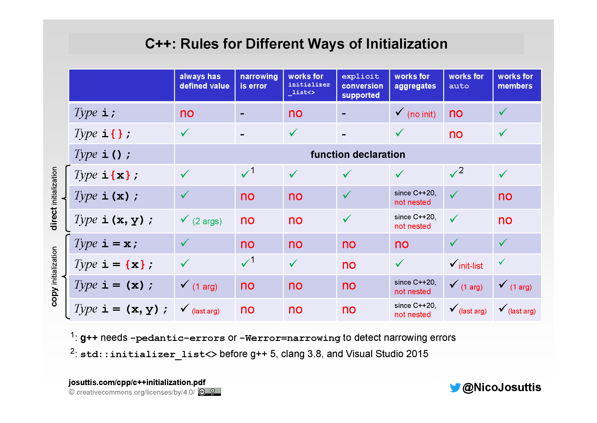

# 简洁易用

```python
l = [1, 2, 3]
d = {'a': 1, 'b': 2, 'b': 3}
```

```python
def foo():
    return 1, 2

x, y = foo()
```

```python
d = {'a': 1, 'b': 2, 'b': 3}

for key, value in d.items():
    print(key, value)
```

```python
def bar(*args):
    print(args)

bar(1, 2, 3)
```

C++ 能不能像 Python 一样简洁且易于使用？使用列表初始化，结构化绑定和可变参数这些现代 C++ 特性可以在一定程度上达到这一目标。

## 1 列表初始化

### 1.1 变量初始化

变量初始化分为 **直接初始化** 和 **复制初始化**。

```cpp
struct S
{
    S(int a) {}
};

void foo(S s) {}

S bar()
{
    return 6;
}

int main()
{
    int i1 = 1;  // 复制初始化
    int i2(2);   // 直接初始化
    S s1 = 3;    // 复制初始化，隐式调用构造函数
    S s2(4);     // 直接初始化
    foo(5);      // 复制初始化，隐式调用构造函数
    S s = bar(); // 复制初始化，隐式调用构造函数
}
```

如果构造函数声明为 `explicit`，隐式调用构造函数的复制初始化会报错。

### 1.2 使用列表初始化

C++11 标准引入了 **列表初始化**，可以使用大括号 `{}` 为变量初始化，同样分为 **直接初始化** 和 **复制初始化**。

```cpp
struct S
{
    S(int a)  {}
    S(int a, double b) {}
};

void foo(S s) {}

S bar()
{
    return {7, 7.5};
}

int main()
{
    int i1 = {1};           // 复制初始化
    int i2 {2};             // 直接初始化
    S s1 = {3};             // 复制初始化
    S s2 {4};               // 直接初始化
    foo({5});               // 复制初始化
    foo({6, 6.5});          // 复制初始化
    S s = bar();            // 复制初始化
    S *ps = new S {8, 8.5}; // 直接初始化
}
```

列表初始化在初始化数组和 STL 容器中有非常大的作用。可以避免程序员手动在循环中初始化。

```cpp
#include <vector>
#include <list>
#include <set>
#include <map>
#include <string>

int main()
{
    int x1[] = {1, 2, 3, 4, 5};
    int x2[] {1, 2, 3, 4, 5};
    std::vector<int> x3 = {1, 2, 3, 4, 5};
    std::vector<int> x4 {1, 2, 3, 4, 5};
    std::list<int> x5 = {1, 2, 3, 4, 5};
    std::list<int> x6 {1, 2, 3, 4, 5};
    std::set<int> x7 = {1, 2, 3, 4, 5};
    std::set<int> x8 {1, 2, 3, 4, 5};
    std::map<std::string, int> x9
    {
        {"a", 1},
        {"b", 2},
        {"c", 3},
    };
    std::map<std::string, int> x10 =
    {
        {"a", 1},
        {"b", 2},
        {"c", 3},
    };
}
```

下表列举了所有初始化方式：



### 1.3 容器的列表初始化实现

容器的列表初始化实现不仅依赖于编译器的支持，更需要满足一个条件：支持以 `std::initializer_list` 为形参的构造函数。

编译器负责把大括号里面的内容构造为一个 `std::initializer_list` 对象，让后寻找 STL 容器中支持以 `std::initializer_list` 为形参的构造函数并调用它。在这个构造函数内调用 `std::initializer_list` 对象的 `begin` 和 `end` 函数，在循环内对本对象进行初始化。

通过上述方法，我们也可以自己搞出一个支持列表初始化的类。

```cpp
#include <iostream>
#include <initializer_list>

class Array
{
public:
    Array(int size) : size(size), data(new int[size]) {}
    Array(std::initializer_list<int> list) : size(list.size()), data(new int[size])
    {
        int index = 0;
        for (const auto &val : list)
        {
            data[index] = val;
            index++;
        }
    }
    int &operator[](int i) { return data[i]; }
    const int &operator[](int i) const { return data[i]; }
    ~Array() { delete[] data; }
    int size;

private:
    int *data;
};

int main()
{
    Array arr{1, 2, 3, 4, 5};
    for (int i = 0; i < arr.size; i++)
        std::cout << arr[i] << " ";
    std::cout << std::endl;
    return 0;
}
```

### 1.4 注意事项

列表初始化相比于传统变量初始化，编译器会对隐式缩窄转换采取更严格的限制，这点需要注意。

此外，编译器优先调用以 `std::initializer_list` 为形参的构造函数：

```cpp
std::vector<int> x1(3, 3);
std::vector<int> x2{3, 3};
```

```cpp
std::map<std::string, int> x9
{
    {"a", 1},
    {"b", 2},
    {"c", 3},
};
```
上面这个例子中，内层的大括号隐式调用了 `std::pair` 的双参数构造函数，外层的大括号隐式调用了 `std::map` 的以 `std::initializer_list` 为形参的构造函数

### 1.5 指定初始化

C++20 标准中引入了指定初始化，允许指定初始化数据成员的名称，从而使代码意图更加准确。

```cpp
struct Point
{
    int x;
    int y;
    int z;
};

Point p1{.x = 1, .y = 2, .z = 3};
Point p2{.z = 3}; // x = 0, y = 0
```

指定初始化需要满足一些条件：
- 对象为聚合类型
- 指定的数据成员必须是非静态的
- 每个数据成员最多只能初始化一次
- 数据成员必须按顺序初始化
- 不能嵌套指定初始化数据成员，但可以这样做：
```cpp
struct Line
{
    Point p1;
    Point p1;
};

Line l{.p1{.y = 3}}; // Line l{.p1.y = 3};
```
- 不能混用其他初始化方式


## 2 结构化绑定

### 2.1 使用结构化绑定

```python
def foo():
    return 1, 2

x, y = foo()
```

上述 python 代码中，`foo()` 返回的元组自动分配给了 `x` 和 `y`。

对应的 C++11 标准代码：

```cpp
#include <iostream>
#include <tuple>

std::tuple<int, int> foo()
{
    return std::make_tuple(1, 2);
}

int main()
{
    int x = 0, y = 0;
    std::tie(x, y) = foo();
    std::cout << x << " " << y << std::endl;
}
```

C++17 标准引入了 **结构化绑定**，一个结构化绑定声明，可以将一个或多个名称绑定到等号右边对象的匿名副本中的一个或多个子对象 / 元素上，相当于给等号右边对象的匿名副本的子对象 / 元素起了别名（但不是引用）。这意味着我们可以简化代码：

```cpp
#include <iostream>
#include <tuple>

auto foo()
{
    return std::make_tuple(1, 2);
}

int main()
{
    auto [x, y] = foo();
    std::cout << x << " " << y << std::endl;
}
```

`auto [x, y] = foo();` 中，`auto` 是类型占位符，`[x, y]` 是绑定标识符列表，`x`、`y` 是用于绑定的名称，绑定的目标是函数 `foo()` 返回结果的副本的子对象 / 元素。

结构化绑定还可以作用于结构体，于是可以这样用：

```cpp
#include <iostream>
#include <string>

struct Item
{
    std::string a = "hello structured bindings";
    int b = 42;
};

int main()
{
    Item item;
    auto [x, y] = item;
    std::cout << x << " " << y << std::endl;
}
```

```cpp
#include <iostream>
#include <string>
#include <vector>

struct Item
{
    std::string a = "hello structured bindings";
    int b = 42;
};

int main()
{
    std::vector<Item> items{
        {"a", 1},
        {"b", 2},
        {"c", 3},
    };
    for (const auto &[x, y] : items)
        std::cout << x << " " << y << std::endl;
}
```

### 2.2 深入理解结构化绑定

```cpp
Item item;
const auto [x, y] = item;
```

上述代码在编译器看来其实是这样的：

```cpp
Item item;
const auto _anonymous = item;
aliasname x = _anonymous.a;
aliasname y = _anonymous.b;
```

编译器首先会创造一个匿名对象，`const auto` 实际上被作用到匿名对象的初始化过程上。

`x` 和 `y` 只是别名而非引用，它们只是匿名对象的子对象的化身，要用到它们时就会现原形。


如果想让 `x` 和 `y` 具有真正的引用特性，那么就是要让匿名对象具有引用特性，所以把结构化绑定中的 `const auto` 改为 `auto&` 即可。

```cpp
#include <iostream>
#include <string>

struct Item
{
    std::string a = "hello structured bindings";
    int b = 42;
};

int main()
{
    Item item;
    auto &[x, y] = item;
    std::cout << item.a << " " << item.b << std::endl;
    x = "hello modern c++";
    std::cout << item.a << " " << item.b << std::endl;
    return 0;
}
```


### 2.3 结构化绑定的 3 种类型

结构化绑定可以作用于 3 种类型
- 原生数组
- 结构体和类对象
- 元组和类元组的对象

所谓类元组的对象就是，对于类元组类型 `T`：
- `std::tuple_size<T>::value` 符合语法，其值为整数，与绑定标识符列表的个数相同。
- `std::tuple_element<i, T>::type` 符合语法，其中 `i` 是小于 `std::tuple_size<T>::value` 的整数。
- `T` 存在合法的成员函数模板 `get<i>()` 或函数模板 `get<i>(t)`，其中 `i` 是小于 `std::tuple_size<T>::value` 的整数。

除了 `std::tuple` 满足上述条件，`std::pair` 和 `std::array` 也满足上述条件。

我们自己也可以创造一个符合条件的类元组类型。

## 3 可变参数

### 3.1 可变参数模板的概念

C++11 标准引入了可变参数模板，也就是类模板或者函数模板的形参个数是可变的。

```cpp
template <class... Args>
void foo(Args... args) {}

template <class... Args>
class bar
{
public:
    bar(Args... agrs)
    {
        foo(args...);
    }
};

int main()
{
    foo();            // void foo<>()
    foo(1);           // void foo<int>(int)
    foo(1, 2.0);      // void foo<int, double>(int, double)
    foo(1, 2.0, 3UL); // void foo<int, double, unsigned long>(int, double, unsigned long)
    bar<> b1;
    bar<int> b2(1);
    bar<int, double> b3(1, 2.0);
    bar<int, double, unsigned long> b4(1, 2.0, 3UL);
}
```

- `class ...Args` 是类型模板形参包，接受零个或多个类型的模板实参。
- `Args ...args` 是函数形参包，出现在函数的形参列表中，可以接受零个或多个函数实参。
- `args...` 是形参包展开，将形参包展开为零个或多个模式的列表，这个过程称为解包。

形参包可以与普通形参结合：
- 在类模板中，形参包必须是形参列表中的最后一个形参。
- 在函数模板中，形参包不必在最后，只要保证后续形参也能通过实参推导或具有默认参数

除了类型模板形参包，非类型模板形参也可以作为形参包。

```cpp
template<int ...Args>
void foo() {};
```

### 3.2 形参包展开

形参包展开的位置：
- 表达式列表
- 初始化列表
- 基类描述
- 成员初始化列表
- 函数参数列表
- 模板参数列表
- 动态异常列表（C++17 标准已弃用）
- lambda 表达式捕获列表
- `sizeof...`
- 对齐运算符
- 属性列表

形参包几乎可以在任何你想得到的地方展开，下面是一些例子：

**示例 1**

```cpp
#include <iostream>

template <class T, class U>
T baz(T t, U u)
{
    std::cout << t << " " << u << std::endl;
    return t;
}

template <class... Args>
void foo(Args... args) {}

template <class... Args>
class bar
{
public:
    bar(Args... args)
    {
        foo(baz(&args, args)...);
    }
};

int main()
{
    bar<int, double, unsigned long> b(1, 2.0, 3UL);
}

```

`baz(&args, args)...` 表示按照 `baz(&args, args)` 这样的模式进行包展开。对于 `bar` 的构造函数，完全展开后变成这样：

```cpp
bar<int, double, unsigned long>::bar(int a0, double a1, unsigned long a2)
{
    foo(baz(&a0, a0),
        baz(&a1, a1),
        baz(&a2, a2));
}
```

**示例 2**

```cpp
#include <iostream>

int add (int a, int b) {return a + b;}
int multiply(int a, int b) {return a * b;}

template<class ...Args>
void foo(int a, int b, Args (*...args)(int, int))
{
    int tmp[] = {(std::cout << args(a, b) << std::endl, 0)...};
}

int main()
{
    foo(3, 4, add, multiply);
}

```

函数模板的形参包也可以接受函数指针。

**示例 3**

```cpp
template <template <class...> class... Args>
class bar : public Args<int, double>...
{
public:
    bar(const Args<int, double> &...args) : Args<int, double>(args)... {}
};

template<class ...Args>
class baz1 {};

template<class ...Args>
class baz2 {};

int main()
{
    baz1<int, double> b1;
    baz2<int, double> b2;
    bar<baz1, baz2> b(b1, b2);
}
```

形参包可以在基类描述中展开。`bar` 的模板形参是一个模板形参包，前面的 `template <class ...>` 只是说明模板形参是一个变参模板，不存在第二个形参包。

**示例 4**

```cpp
#include <iostream>

template<class ...Args>
void foo(Args ...args)
{
    size_t value = sizeof...(args);
    std::cout << value << std::endl;
}

int main()
{
    foo();
    foo(1);
    foo(1, 2);
    foo(1, 2, 3, 4);
}
```

`sizeof...` 运算符获取形参包中形参的个数，返回的类型是 `size_t`。

### 3.3 递归与折叠表达式

C++11 标准中，可以用递归的方式对可变参数模板形参包的包展开进行逐个计算。

```cpp
#include <iostream>

template<class T>
T sum(T arg)
{
    return arg;
}

template<class T1, class ...Args>
auto sum(T1 arg1, Args ...args)
{
    return arg1 + sum(args...);
}

int main()
{
    std::cout << sum(1, 2.0, 3UL) << std::endl;
}
```

C++17 引入了折叠表达式可以极大地简化代码，在语义上也非常清晰。

```cpp
#include <iostream>

template <class... Args>
auto sum(Args... args)
{
    return (args + ...);
}

int main()
{
    std::cout << sum(1, 2.0, 3UL) << std::endl;
}
```

- `(args op ...)` 折叠为 `(arg0 op (arg1 op ... (argN-1 op argN)))`
- `(... op args)` 折叠为 `((((arg0 op arg1) op arg2) op ... ) op argN)`
- `(args op ... op init)` 折叠为 `(arg0 op (arg1 op ... (argN op init)))`
- `(init op ... op args)` 折叠为 `((((init op arg0) op arg1) op ... ) op argN)`

```cpp
#include <iostream>

template<class ...Args>
void print(Args ...args)
{
    (std::cout << ... << args) << std::endl;
}

int main()
{
    print("hello ", "fold ", "expression");
}
```