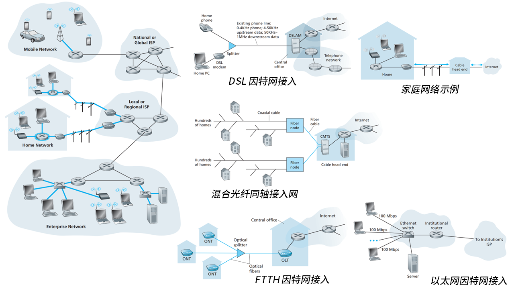
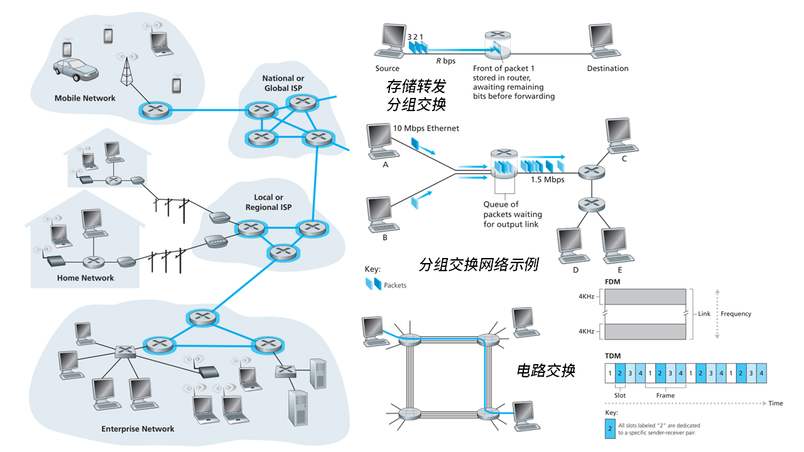

# 计算机网络和因特网

- 什么是因特网？什么是协议？
- 网络边缘：端系统、接入网、物理媒体
- 网络核心：分组 / 电路交换
- 性能：时延、丢包、吞吐量
- 协议层次与服务模型
- 网络安全

## 1 因特网概述

**因特网**（Internet）是什么？这个问题可以从构造和服务两个角度来回答。

因特网建立在**协议**（protocol）之上。

### 1.1 构造

因特网包含海量的 **端系统**（end system）或主机（host）。端系统之间通过 **通信链路**（communication link）和 **分组交换机**（packet switch）相连接。端系统彼此交换 **报文**（message），长的报文被划分为 **分组**（packet）在网络中传输。分组通过的一系列通信链路和分组交换机称为 **路径**（route）。
- 端系统：PC、手机、智能电器等联网设备都属于端系统。
- 通信链路：通信链路由不同类型的物理媒体组成，如同轴电缆、光纤、卫星等。传输速率 / 带宽（bandwidth）以比特每秒（bps）计。
- 分组交换机：分组交换机连接着通信链路，用于转发分组，包括 **路由器**（router）和 **链路层交换机**（link-layer switch）。

> 类比物流网络：端系统——工厂和仓库，通信链路——公路，分组交换机——交叉口，分组——卡车

因特网是网络的网络，由众多 **因特网服务提供商**（ISP）组成。每个 ISP 自身就是一个由分组交换机和通信链路组成的网络。ISP 之间彼此互联，且有层级关系。

### 1.2 服务

因特网作为基础设施，为应用程序提供服务。

电子邮件、社交网络、流媒体、网络游戏等涉及多个相互交换数据的端系统的因特网应用程序，统称为 **分布式应用程序**（distributed application）。

与因特网相连的端系统提供了一个 **套接字接口**（socket interface），该接口规定了运行在一个端系统上的程序请求因特网基础设施向运行在另一个端系统上的特定目的地程序交付数据的方式。因特网套接字接口是一套发送程序必须遵循的规则集合，因此因特网能够将数据交付给目的地。

> 类比送信：邮政服务有一套邮政服务规则，寄信人必须遵守这套规则，才能让邮局将自己的信寄给收信人。

### 1.3 协议

**协议** 是一组规则，定义了网络实体之间发送和接收的报文的 **格式**、**顺序**，以及在消息传输和接收上采取的 **动作**。

> 类比人类的交流活动也有一套预先规定的准则：假设 A 与 B 聊天，由 A 发话。A 先对 B 说“你好”。如果 B 想继续听下去，则可以用“你好”进行回应，那么 A 可以继续询问；如果 B 不愿听下去，则可以用“不要烦我”来回应，那么 A 最好识趣地走开。总结一下，如果这份聊天协议正常运作，人们会发送特定的报文，以及根据接收到的响应或其他的一些事件采取相应的动作。

端系统、分组交换机和其他因特网部件都要运行一系列协议，这些协议控制因特网中信息的接收和发送。因特网采用的两个最重要的协议：
- **TCP**（Transmission Control Protocol）
- **IP**（Internet Protocol）定义了在路由器和端系统之间发送和接收的分组格式

此外还有 HTTTP、FTP、PPP 等。

## 2 网络边缘

因特网的最末端是 **端系统**，它分为两类：
- **客户**（client）：如 PC、智能手机等
- **服务器**（server）：用于存储和发布 Web 页面、流视频、中继电子邮件等，大部分在数据中心。

**接入网** 是将端系统物理连接到边缘路由器（edge router）的网络。边缘路由器是到任何其他远程端系统的路径的第一台路由器。

- 家庭接入：
    - 数字用户线（Digital Subscriber Line, DSL）：利用现有的电话线（双绞铜线），频分复用。家庭 PC → DSL 调制解调器（DSL modem） → 电话线 → 本地中心局（CO）的数字用户线接入复用器（DSLAM） → 因特网
    - 混合光纤同轴（Hybrid Fiber Coax, HFC）：利用现有的有线电视设施，频分复用。家庭 PC → 以太网 → 电缆调制解调器（cable modem） → 同轴电缆（Coaxical Cable） → 光缆（Fibre Cable） → 电缆调制解调器端接系统（Cable Modem Termination System, CMTS） → 因特网
    - 光纤到户（Fiber To The Home, FTTH）：光纤网络端接器（Optical Network Terminator, ONT） → 分配器（splitter） → 光纤线路端接器（Optical Line Terminator, OLT）
- 局域网（LAN）接入：
    - 以太网（Ethernet）
    - 无限局域网：802.11b/g/n（WiFi）
- 广域无线接入：蜂窝移动数据

**物理媒体**：
- 双绕铜线
- 同轴电缆
- 光纤
- 陆地无线电信道
- 卫星无线电信道

## 3 网络核心

因特网的核心有两个主要功能：
- **交换**（switching）/ 转发（forwarding）：本地操作，把分组从输入链路转移到恰当的输出链路上
- **路由**（routing）：全局操作，确定分组采用的从源到目的地的路径

> 类比开车从上海到武汉可以途径湖州、芜湖、安庆、黄冈，也可以途径苏州、南京、合肥、六安、黄冈，这样的全局的路径选择就是路由，而选择 G42 还是 G4221 这样的局部的链路选择就是交换。

**分组交换**（packet switching）：
- 存储转发传输（store and forward transmission）：整个分组必须全部到达交换机后才能向输出链路传输。
- 如果到达的分组需要传输到某条链路，但发现该链路正忙于传输其他分组，该到达分组必须在输出缓存（output buffer）中等待：
    - 排队时延：分组在输出缓存排队等待传输造成的时延。
    - 分组丢失 / 丢包（packet loss）：如果路由器的缓存空间已满，分组可能会被丢弃。
- 转发表（forwarding table）：每台路由器具有一个转发表，用于将目的地址（或目的地址的一部分）映射成为输岀链路。当
- 路由选择协议（routing protocol）：因特网具有一些特殊的路由选择协议，用于自动地设置转发表。

通过由 $N$ 条速率均为 $R$ 的链路组成的路径，从源到目的地发送一个 $L$ 比特的分组，端到端的时延是
$$ t_{\text{trans}}=N\frac{L}{R} $$

