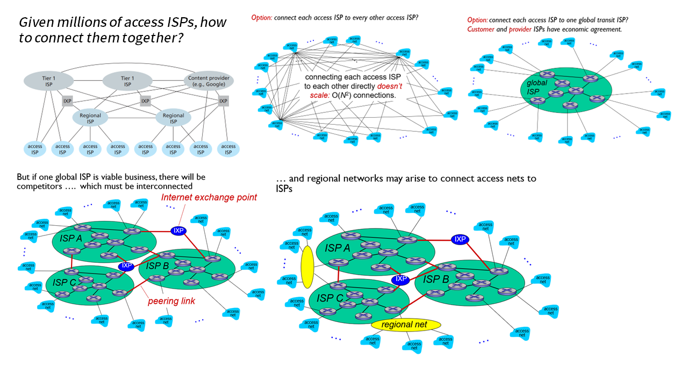

# 计算机网络和因特网

- 什么是因特网？什么是协议？
- 网络边缘：端系统、接入网、物理媒体
- 网络核心：分组 / 电路交换
- 性能：时延、丢包、吞吐量
- 协议层次与服务模型
- 网络安全

## 1 因特网概述

*如何定义因特网？*

**因特网**（Internet）是什么？这个问题可以从构造和服务两个角度来回答。

### 1.1 构造

因特网包含海量的 **端系统**（end system）或主机（host）。端系统之间通过 **通信链路**（communication link）和 **分组交换机**（packet switch）相连接。端系统彼此交换 **报文**（message），长的报文被划分为 **分组**（packet）在网络中传输。分组通过的一系列通信链路和分组交换机称为 **路径**（route）。
- 端系统：运行应用程序。PC、手机、智能电器等联网设备都属于端系统。
- 通信链路：物理媒体，如同轴电缆、光纤、卫星等。传输速率 / 带宽（bandwidth）以比特每秒（bps）计。
- 分组交换机：分组交换机连接着通信链路，用于转发分组，包括 **路由器**（router）和 **链路层交换机**（link-layer switch）。

> 类比物流网络：端系统——工厂和仓库，通信链路——公路，分组交换机——交叉口，分组——卡车

因特网是网络的网络，由众多 **因特网服务提供商**（ISP）组成。每个 ISP 自身就是一个由分组交换机和通信链路组成的网络。ISP 之间彼此互联，且有层级关系。

### 1.2 服务

因特网作为基础设施，为应用程序提供服务。

电子邮件、社交网络、流媒体、网络游戏等涉及多个相互交换数据的端系统的因特网应用程序，统称为 **分布式应用程序**（distributed application）。

与因特网相连的端系统提供了一个 **套接字接口**（socket interface），该接口规定了运行在一个端系统上的程序请求因特网基础设施向运行在另一个端系统上的特定目的地程序交付数据的方式。因特网套接字接口是一套发送程序必须遵循的规则集合，因此因特网能够将数据交付给目的地。

> 类比送信：邮政服务有一套邮政服务规则，寄信人必须遵守这套规则，才能让邮局将自己的信寄给收信人。

### 1.3 协议

因特网建立在**协议**（protocol）之上。

**协议** 是一组规则，定义了网络实体之间发送和接收的报文的 **格式**、**顺序**，以及在消息传输和接收上采取的 **动作**。

因特网采用的两个最重要的协议：
- **TCP**（Transmission Control Protocol）
- **IP**（Internet Protocol）定义了在路由器和端系统之间发送和接收的分组格式

此外还有 HTTP、FTP、PPP 等协议。

> 类比人类的交流活动也有一套预先规定的准则：假设 A 与 B 聊天，由 A 发话。A 先对 B 说“你好”。如果 B 想继续听下去，则可以用“你好”进行回应，那么 A 可以继续询问；如果 B 不愿听下去，则可以用“不要烦我”来回应，那么 A 最好识趣地走开。总结一下，如果这份聊天协议正常运作，人们会发送特定的报文，以及根据接收到的响应或其他的一些事件采取相应的动作。

## 2 网络边缘

*端系统如何接入因特网？*

### 2.1 端系统

因特网的最末端是 **端系统**，它分为两类：
- **客户**（client）：如 PC、智能手机等
- **服务器**（server）：用于存储和发布 Web 页面、流视频、中继电子邮件等，大部分在数据中心。

### 2.2 接入网

**接入网** 是将端系统物理连接到边缘路由器（edge router）的网络。

- 家庭接入：
    - 数字用户线（Digital Subscriber Line, DSL）：利用现有的电话线（双绞铜线），频分复用。家庭 PC → DSL 调制解调器（DSL modem） → 电话线 → 本地中心局（CO）的数字用户线接入复用器（DSLAM） → 因特网
    - 混合光纤同轴（Hybrid Fiber Coax, HFC）：利用现有的有线电视设施，频分复用。家庭 PC → 以太网 → 电缆调制解调器（cable modem） → 同轴电缆（Coaxical Cable） → 光缆（Fibre Cable） → 电缆调制解调器端接系统（Cable Modem Termination System, CMTS） → 因特网
    - 光纤到户（Fiber To The Home, FTTH）：光纤网络端接器（Optical Network Terminator, ONT） → 分配器（splitter） → 光纤线路端接器（Optical Line Terminator, OLT）
- 局域网（LAN）接入：
    - 以太网（Ethernet）
    - 无限局域网：802.11b/g/n（WiFi）
- 广域无线接入：蜂窝移动数据

## 3 网络核心

*数据如何通过因特网传送到正确的地方？*

### 3.1 交换和路由

因特网的核心完成了两个主要功能：
- **交换**（switching）/ 转发（forwarding）：本地操作，把分组从输入链路转移到恰当的输出链路上
- **路由**（routing）：全局操作，确定分组采用的从源到目的地的路径

### 3.2 交换方式

**分组交换**（packet switching）：
- 存储转发传输（store and forward transmission）：整个分组必须全部到达交换机后才能向输出链路传输。
- 如果到达的分组需要传输到某条链路，但发现该链路正忙于传输其他分组，该到达分组必须在输出缓存（output buffer）/ 输出队列（output queue）中等待：
    - 排队时延（queuing delay）：分组在输出缓存排队等待传输造成的时延。
    - 分组丢失 / 丢包（packet loss）：如果路由器的缓存空间已满，分组可能会被丢弃。
- 转发表（forwarding table）：每台路由器具有一个转发表，用于将目的地址（或目的地址的一部分）映射成为输岀链路。
- 路由选择协议（routing protocol）：因特网具有一些特殊的路由选择协议，用于自动地设置转发表。

如果通过一条速率为 $R$ 的链路发送一个 $L$ 比特的分组，那么传输时延是
$$ t_{\text{trans}}=\frac{L}{R} $$

**电路交换**（circuit switching）：*传统的电话网络*
- 为每一个会话（call）预留专门的资源，确保以恒定速率传输数据，且不会丢失数据。
- 使用频分复用（FDM）和时分复用（TDM）来“分割”资源

假设一条有 $N$ 个用户共用一条 1 Gbps 的链路，每个用户在忙时需要占用 100 Mbps 的带宽，只有 10% 的时间在忙。
- 如果采用电路交换，最多只能支持 10 个用户
- 如果采用分组交换，如果有 35 个用户，10 个以上用户同时在忙的可能性为 0.0004，这意味着分组交换相比于电路交换，用一些非常偶然的延迟和损失去换取更多的支持用户，这被称为统计复用增益。

> 0.0004 的计算过程：$ \displaystyle P= \sum \limits_{x=11}^{35} C_{35}^x \cdot 0.1^x \cdot 0.9^{35-x} \approx 0.0004$

### 3.3 网络的网络

**网络层级**：
- 接入 ISP（access ISP）
- 区域 ISP（regional ISP）
- 第一层 ISP（tier-1 ISP）：如 ChinaNet、China169、CMNET 等，由网络运营商中国电信、中国联通、中国移动管理。

## 4 性能

### 4.1 时延

考虑单台路由器上的时延：

$$
d_{\text{nodal}}=d_{\text{proc}} + d_{\text{queue}} + d_{\text{trans}} + d_{\text{prop}}
$$

**节点处理时延**（nodal processing delay）
- 检查比特差错、决定输出链路造成的时延
- 通常是毫秒级

**排队时延**（queuing delay）
- 分组在输出缓存排队等待传输造成的时延
- 由路由器的拥挤程度所决定，how?：**流量强度**（traffic intensity） $ La/R $，越接近 1，排队时延越高
    - $a$：分组到达率（pkt/s)
    - $L$：分组大小（bit/pkt）
    - $R$：链路带宽（bps）

> 专门研究这一问题的学科叫做排队论（queuing theory）。
 
**传输时延**（transmission delay）：$ d_{\text{trans}}=L/R $ *——将分组“推向”链路的时间*
- $R$：链路带宽（bps）
- $L$：分组大小（bit）

**传播时延**（propagation delay）：$ d_{\text{prop}} = d/s $ *——分组在链路中传播的时间*
- $d$：两台路由器之间的距离
- $s$：物理媒体的传播速率（等于或略小于光速）

### 4.2 丢包

如果路由器的缓存空间已满，分组可能会被丢弃（drop）。

被丢弃的分组可能会被上一个节点、源端系统重新传输，或者不传输。

### 4.3 吞吐量

吞吐量从主机 A 到主机 B 发送数据的比特率。
- 瞬时吞吐量（instantaneous throughput）
- 平均吞吐量（average throughput）

由瓶颈链路（bottleneck link）决定。

> 类比管道

## 5 协议层次及其服务模型

为什么要分层？
- 结构化
- 模块化，易于维护和升级

五层结构
- application 应用层：提供网络应用程序和应用层协议 （HTTP, IMAP, SMTP, DNS）报文（message）
- transport 传输层：在应用程序端点之间传输运输层报文（TCP, UDP）报文段（segment）
- network 网络层：负责将分组从一台主机移动到另一台主机（IP）数据包（datagram）
- link 链路层：沿着路经将数据报传递给下一层结点（Ethernet, 802.11, PPP）帧（frame）
- physical 物理层：将整个帧从一个网络元素移动到邻近的网络元素

